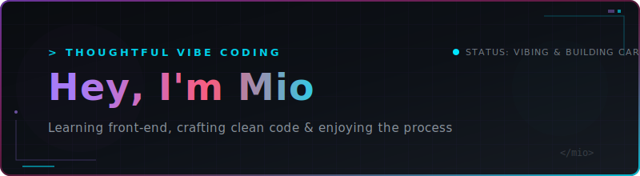

  

  

  
  &nbsp;&nbsp;
  

---

<table border="0" cellpadding="10" cellspacing="0" width="100%">
  <tr>
    <td width="55%" valign="top">
      <h3>🚀 About Me</h3>
      
Hey there! I'm a vibe coder from Germany who likes to take things slow but build them carefully. I'm currently learning front-end development and love crafting clean, visually pleasing web projects.

      <ul>
        <li>🎂 <b>Born:</b> June 2nd, 2005 (21 years old)</li>
        <li>💻 <b>Focus:</b> Clean code, modern UI/UX design &amp; learning new frameworks</li>
        <li>📧 <b>Contact:</b> <a href="mailto:contact@miouup.de">contact@miouup.de</a></li>
        <li>💬 <b>Q&amp;A:</b> Ask me anything <a href="https://github.com/miouup/miouup/issues">here</a></li>
      </ul>
    </td>
    <td width="45%" valign="top" align="center">
      <h3>🎮 Discord Status</h3>
      
    </td>
  </tr>
</table>

---

<h3 align="center">🛠️ Tech Stack &amp; Tools</h3>

  

---

<h3 align="center">📊 GitHub Statistics</h3>

  <table border="0" cellpadding="5" cellspacing="0" width="100%">
    <tr>
      <td width="50%" align="center" valign="top">
        
      </td>
      <td width="50%" align="center" valign="top">
        
      </td>
    </tr>
    <tr>
      <td width="50%" align="center" valign="top">
         
        
      </td>
      <td width="50%" align="center" valign="top">
         
        
      </td>
    </tr>
  </table>

   
  

